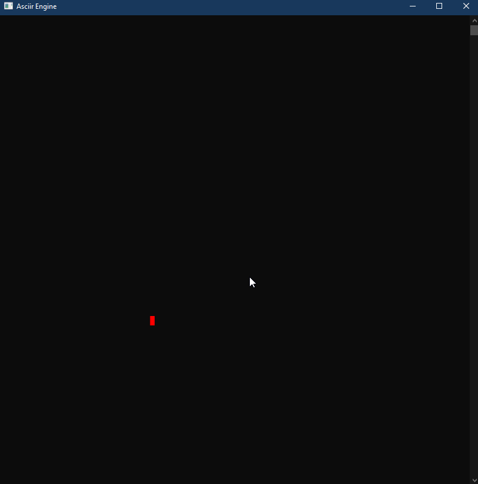

# AsciiRender
a text / ascii based game engine that uses ansi escape codes and the terminal to render the game.
Some of the engine is being built with the help of the [game engine tutorial series by The Cherno](https://www.youtube.com/watch?v=JxIZbV_XjAs&list=PLlrATfBNZ98dC-V-N3m0Go4deliWHPFwT).

> ###### *example of what it can currently do*
> 
> 
> #### the source code for this example is in the BasicInputExample project
